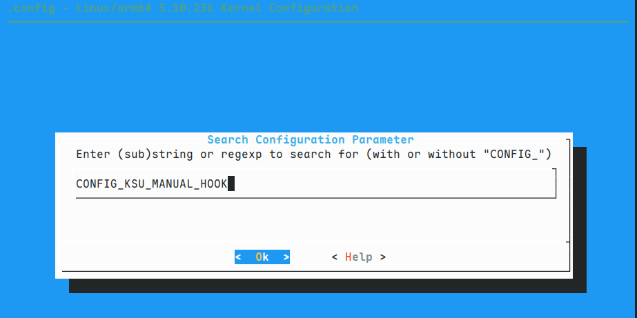
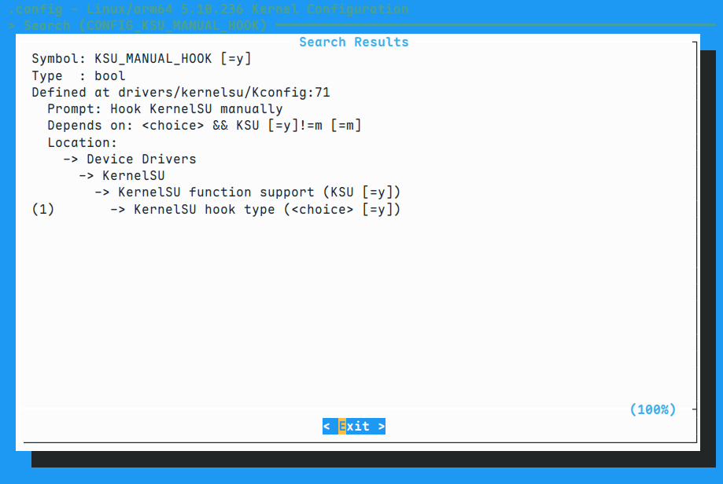
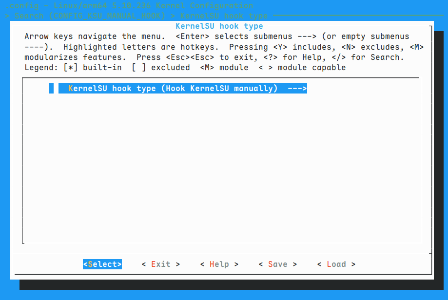
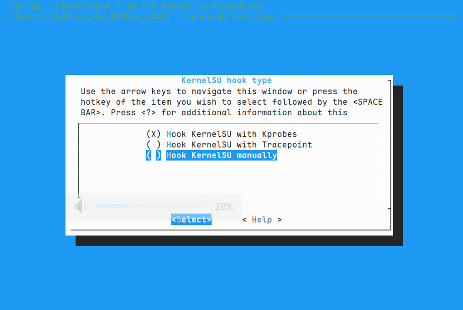
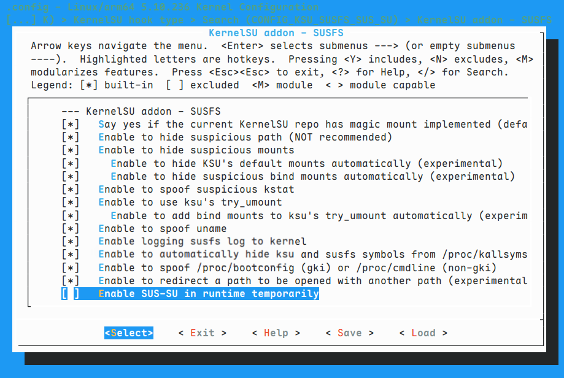
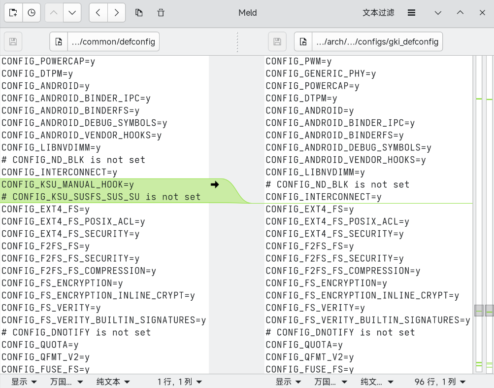

> 编译的内核使用在`Redmi Note 12 Tubro`上，仅供参考
  
## 目录
- [目录](#目录)
- [1. 编译前准备](#1-编译前准备)
  - [1.1 编译环境准备](#11-编译环境准备)
  - [1.2 内核源码准备](#12-内核源码准备)
  - [1.3 安装SukiSU Ultra](#13-安装sukisu-ultra)
  - [1.4 给内核打补丁](#14-给内核打补丁)
    - [1.4.1 补丁准备](#141-补丁准备)
    - [1.4.2 安装补丁](#142-安装补丁)
  - [1.5 修改内核配置](#15-修改内核配置)
    - [1.5.1 修改配置](#151-修改配置)
    - [1.5.2 保存配置](#152-保存配置)
- [2. 编译内核](#2-编译内核)
- [3. 打包内核](#3-打包内核)


## 1. 编译前准备
### 1.1 编译环境准备
- 我使用的Arch Linux，直接运行`sudo pacman -S repo`安装`repo`工具，其他安装方式见`https://source.android.google.cn/docs/setup/start/requirements#repo`
- 然后安装编译内核所需的工具，找到一个空目录作为编译的目录，在目录下面运行
```  bash
# 初始化存储库
repo init -q -u https://github.com/FlyLoongZ/kernel_build_scripts -b repo_manifest
# 同步存储库
repo sync
```
- 同步完成目录结构如下
```
空目录
├── build
├── host_tools
├── prebuilts 
└── prebuilts-master
```

### 1.2 内核源码准备
- 使用[msm-5.10](https://git.codelinaro.org/clo/la/kernel/msm-5.10)高通内核源码，分支为`kernel.lnx.5.10.r1-rel`，克隆到编译目录
``` bash
git clone https://git.codelinaro.org/clo/la/kernel/msm-5.10.git -b kernel.lnx.5.10.r1-rel common
```
- 克隆完成目录结构如下
```
空目录
├── build
├── common
├── host_tools
├── prebuilts 
└── prebuilts-master
```

### 1.3 安装SukiSU Ultra
- 安装[SukiSU Ultra](https://github.com/SukiSU-Ultra/SukiSU-Ultra)，使用带susfs的分支`susfs-main`
``` bash
# 进入common(内核所在目录)
cd common
# 安装SukiSU Ultra
curl -LSs "https://raw.githubusercontent.com/SukiSU-Ultra/SukiSU-Ultra/main/kernel/setup.sh" | bash -s susfs-main
```

### 1.4 给内核打补丁
#### 1.4.1 补丁准备
- 克隆[susfsksu](https://gitlab.com/simonpunk/susfs4ksu) ，分支为`gki-android12-5.10`
``` bash
git clone https://gitlab.com/simonpunk/susfs4ksu.git -b gki-android12-5.10
```
- 下载来自[SukiSU_patch](https://github.com/SukiSU-Ultra/SukiSU_patch)的补丁`69_hide_stuff.patch`和`hooks/syscall_hooks.patch`
> `69_hide_stuff.patch` 用于隐藏类原生信息和隐藏zygote修改，
`syscall_hooks.patch`用于启用SukiSU-Ultra的Manual hook功能
#### 1.4.2 安装补丁
- 进入`susfsksu`的`kernel_patches`目录，将目录下对应目录文件复制到`common`对应目录，由于我们使用的是`SukiSU Ultra`的`susfs`分支所以不用复制`KernelSU`文件夹内补丁
- 将之前下载的`69_hide_stuff.patch`和`syscall_hooks.patch`复制到common目录
``` bash
# 在common目录
patch -p1 < 50_add_susfs_in_gki-android12-5.10.patch
patch -p1 < 69_hide_stuff.patch
patch -p1 < syscall_hooks.patch
```

### 1.5 修改内核配置
#### 1.5.1 修改配置
- 在common目录运行下面的命令进入内核配置编辑tui
``` bash
make ARCH=arm64 gki_defconfig
make ARCH=arm64 menuconfig
```
- 按`/`键进入搜索内核配置界面
- 输入`CONFIG_KSU_MANUAL_HOOK`

- 按`确认键`来到下图界面

- 按`1`来到对应配置设置

- 按`确认键`进入修改配置界面
- 使用`方向键`移动到对应选项，按`确认键`修改配置

- 按`/`搜索`CONFIG_KSU_SUSFS_SUS_SU`
- 按`空格`修改`CONFIG_KSU_SUSFS_SUS_SU`为禁用

- 最后使用`方向键`移动到`<save>`保存修改
- 使用`Ctrl + C`退出tui
- 运行`make ARCH=arm64 savedefconfig`得到`defconfg`文件
- 运行`make ARCH=arm64 mrproper`清理环境

#### 1.5.2 保存配置
- 使用`Meld`工具比较`defconfig`和`arch/arm64/configs/gki_defconfig`
- 找到上面修改的配置，点击gui上的箭头插入修改到`gki_defconfig`，然后保存修改


## 2. 编译内核
``` bash
# 在你选择的空目录运行
LTO=thin BUILD_CONFIG=common/build.config.gki.aarch64 BUILD_NUMBER=13968086 build/build.sh -j$(nproc --all) | tee build.log
```
> `BUILD_NUMBER`来自[Android CI](ci.android.com)，编译后产物在`out/android12-5.10/dist`目录

## 3. 打包内核
- 克隆[AnyKernel3](https://github.com/osm0sis/AnyKernel3)，将内核`Image`复制到其目录
- 修改`anykernel.sh`中对应配置为下面的值
``` bash
do.devicecheck=1
device.name1=marble

BLOCK=auto;
IS_SLOT_DEVICE=auto;
RAMDISK_COMPRESSION=auto;
PATCH_VBMETA_FLAG=auto;
```
- 将目录文件打包为zip压缩包
``` bash
# 在AnyKenrnel3根目录运行，也可以手动打包（排除.git, .github, README.md文件）
zip -r9 UPDATE-AnyKernel3.zip * -x .git README.md 
```
